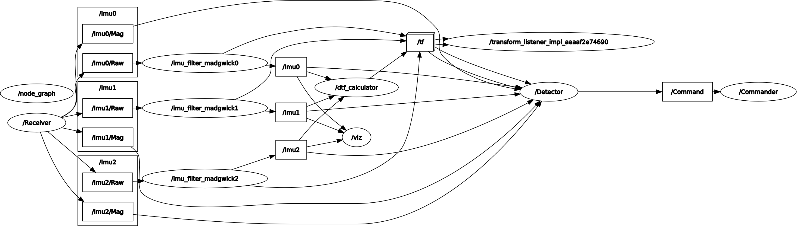

# ROS

## Flow

Drawio


Rqt_graph



- Receiver
    - Input: NA
    - Output: /Imu0/Raw, /Imu0/Mag, /Imu1/Raw, /Imu1/Mag, /Imu2/Raw, /Imu2/Mag

- Filter
    - Input: /Imu0/Raw, /Imu0/Mag, /Imu1/Raw, /Imu1/Mag, /Imu2/Raw, /Imu2/Mag
    - Output: /Imu0, /Imu1, /Imu2

- Dtf_calculator
    - Input: /Imu0/Raw, /Imu1/Raw, /Imu2/Raw
    - Output: /tf

- Detector
    - Input: /Imu0/Raw, /Imu1/Raw, /Imu2/Raw, /tf
    - Output: /Command

- Commander
    - Input: /Command
    - Output: NA

- Labeler
    - Input: /Imu0, /Imu1, /Imu2, /tf
    - Output: /User_Label

## CLI

### Install Environment

```bash
sudo bash setup.sh
```

### Setup Environment

```bash
# global config, for ros system cli, such as "ros", "rviz2", "rqt"
source /opt/ros/foxy/setup.sh 

# workspace config, for our own-made packages, such as "receiver", "filter"
cd ~/FYP-ROS
source install/setup.bash
```

> please do `source install/setup.bash` before running any own-made package

### Create a package

```bash
# for c++ package
ros2 pkg create --build-type ament_cmake [package]

# for python package
ros2 pkg create --build-type ament_python [package]
```

More about creating and configuring the package:
1. Write your python code under [package]/[package]/[package.py]
2. Add an entry point to setup.py so that ros2 can locate its position
    ```python
    entry_points={
        'console_scripts': [
            '[node_name] = [package].[script]:main',
        ],
    }
    ```
    
    Create a Python package:
        [Writing a simple publisher and subscriber (Python) - ROS 2 Documentation: Foxy documentation](https://docs.ros.org/en/foxy/Tutorials/Beginner-Client-Libraries/Writing-A-Simple-Py-Publisher-And-Subscriber.html)
        
    Entry Point For Python:
        [Developing a ROS 2 package - ROS 2 Documentation: Foxy documentation](https://docs.ros.org/en/foxy/How-To-Guides/Developing-a-ROS-2-Package.html#python-packages)
        

### Compile

```bash
# build a package
colcon build --packages-select [package]

# build a package with its dependencies(recommended)
colcon build --packages-up-to [package]

# build all packages under the workspace
colcon build
```

### ROS Bag

```bash
ros2 bag play [data.bag] # 播放bag
ros2 bag info [data.bag] # 查詢bag裡有多少message, topic, etc
ros2 bag record -a       # record all topics

# some useful flags
-l # 循環播放
-r [rate] # 倍速播放
--remap [origin topic] [new topic] # topic rename

# for example, play only raw topic
ros2 bag play rosbag/rosbag2_2023_01_07-17_05_41/ 
	--remap /Imu0:=/t0 /Imu1:=/t1 /Imu2:=/t2 -r 5 -l

ros2 bag play rosbag2_2023_01_19-03_13_00/ 
--remap /Imu0:=/d /Imu1:=/d /Imu2:=/d /tf:=/t /tf_static:=/t -l -r 3
```

### Launch file

[Using Python, XML, and YAML for ROS 2 Launch Files - ROS 2 Documentation: Foxy documentation](https://docs.ros.org/en/foxy/How-To-Guides/Launch-file-different-formats.html)

[Tutorial: ROS2 launch files - All you need to know - Robotics Casual](https://roboticscasual.com/tutorial-ros2-launch-files-all-you-need-to-know/)

## Our Packages

### Receiver

This node receives IMU raw data from the glove(ESP32) and publish it to ROS network

```bash
ros2 run receiver receiver
```

### IMU Filter

This node takes IMU raw data(accel, gyro, and optionally magnetic) and calculate the roll, pitch, yaw value of an IMU.

```bash
# imu node filter 
ros2 launch imu_filter_madgwick imu0.launch.py

# imu cluster filter, 
# this will launch imu0.launch, imu1.launch, imu2.launch + static tf
ros2 launch imu_filter_madgwick imu_cluster.launch.py
```

### IMU Covariance Matrix Calculator

This node calculates IMU’s covariance matrix based on the given sequence of IMU reading

```bash
ros2 run covariance_matrix_calculator calculator
```

### Dynamic Transform Calculator

This node calculates the dynamic tf of the hand

```bash
ros2 run dynamic_transform_calculator calculator
```

### Labeler

This node is used to label training data

1. change the bag name in launch_master/label.launch.py
2. launch labeler
    
    ```bash
    ros2 launch launch_master label.launch.py
    ```
    
3. input label in another terminal using ros2 pub cli
    
    ```python
    ros2 topic pub /User_Label std_msgs/msg/String "{data: 6}"  --once
    ```
    

### Detector

This node recognizes different gesture 

```bash
ros2 run detector gesture_detection 

ros2 launch detector gesture_detection.launch.py 
```

### Commander

This node takes the output of the detector and control powerpoint

```bash
ros2 run commander control

ros2 launch commander control.launch.py
```

### Launch Master

This package launch a sequence of nodes

```bash
# inference
ros2 launch launch_master inference.launch.py

# label
ros2 launch launch_master label.launch.py
```

### Rviz

X axis is indicated in red, the Y axis is indicated in green, and the Z axis is indicated in blue.

```bash
rviz2 --display-config src/glove.rviz
```

### Collecting data

```python
cd FYP-ROS/rosbag/bag/
ros2 bag record /Imu0 /Imu1 /Imu2 /Imu0/Raw /Imu1/Raw /Imu2/Raw /tf /tf_static
```